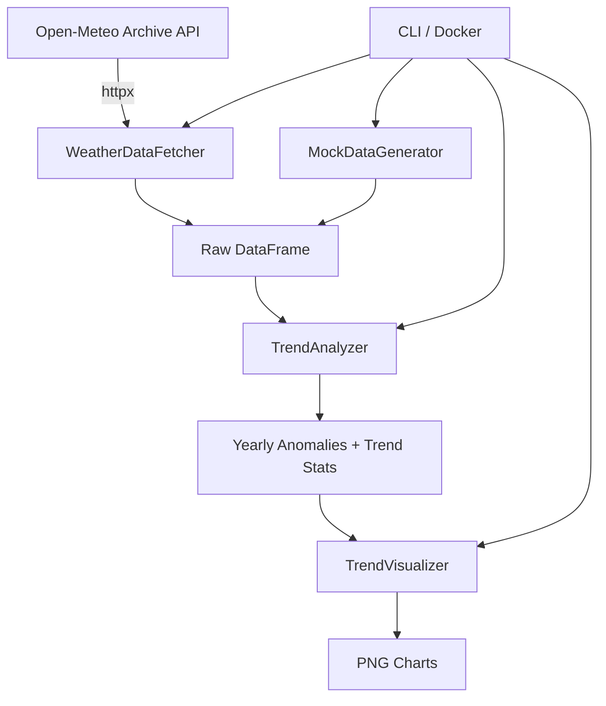

# Weather Trends Analyzer

A global weather trend analysis tool that fetches historical temperature data (1940-2025) from the Open-Meteo Archive API for 12 representative cities worldwide, computes anomalies and linear trends with statistical significance, and produces publication-quality visualizations.

## Architecture



## Phase Roadmap


| Phase | Description | Status |
|-------|-------------|--------|
| 1 | CLI script with Docker and CI/CD | In Progress |
| 2 | Interactive Streamlit dashboard | Planned |
| 3 | FastAPI backend + PostgreSQL + scheduled collection | Planned |

## Cities Analyzed

12 representative cities selected for geographic diversity:

New York, London, Tokyo, Sydney, Cairo, Rio de Janeiro, Mumbai, Moscow, Beijing, Cape Town, Los Angeles, Singapore

## How to Run

### With Docker (recommended)

```bash
# macOS / Linux
./run_weather_trends.sh

# Windows
run_weather_trends.bat
```

The launcher script builds and runs the Docker container, then enters an interactive menu:
- `[k]` Stop, keep images
- `[q]` Stop, remove images
- `[v]` Full cleanup (images + volumes)
- `[r]` Restart (stop, rebuild, relaunch)

### Without Docker

```bash
# Install dependencies
uv sync

# Run the analysis
uv run python -m src.cli

# Run tests
uv run pytest --cov

# Lint
uv run ruff check .
```

## Output

Charts are saved to the `output/` directory as 300 DPI PNGs:
- Global temperature trend with 95% CI and regression line
- Temperature anomaly distribution
- Per-city trend comparison
- Decade-averaged anomalies

## Data Source

[Open-Meteo Archive API](https://open-meteo.com/) — free, no API key required. Daily mean temperature at 2m height (`temperature_2m_mean`), 1940-2025.

## Tech Stack

- Python 3.13
- pandas, numpy, scipy
- seaborn + matplotlib
- httpx
- Pydantic v2
- Docker (python:3.13-slim)
- GitLab CI/CD