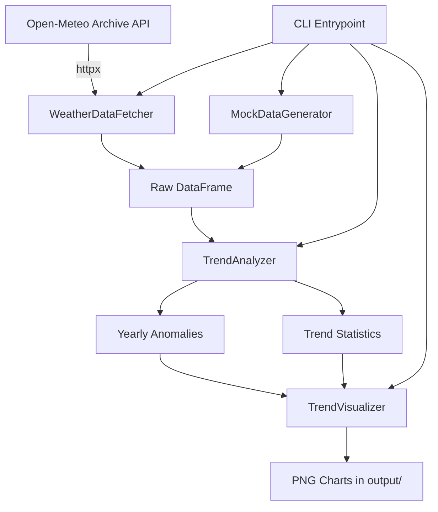
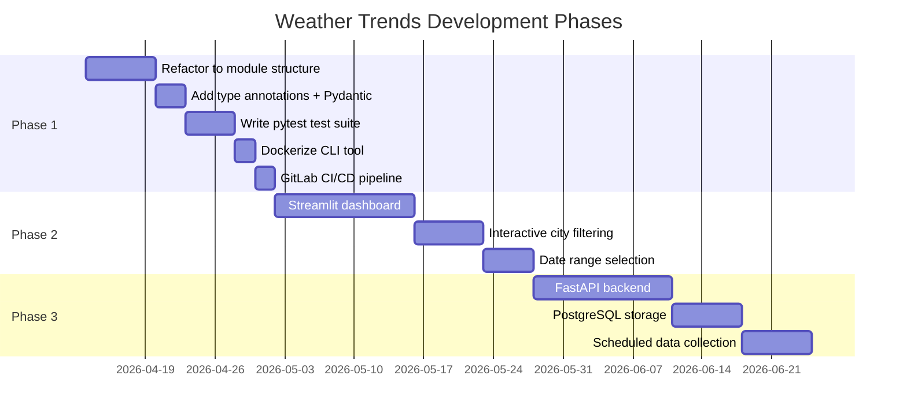
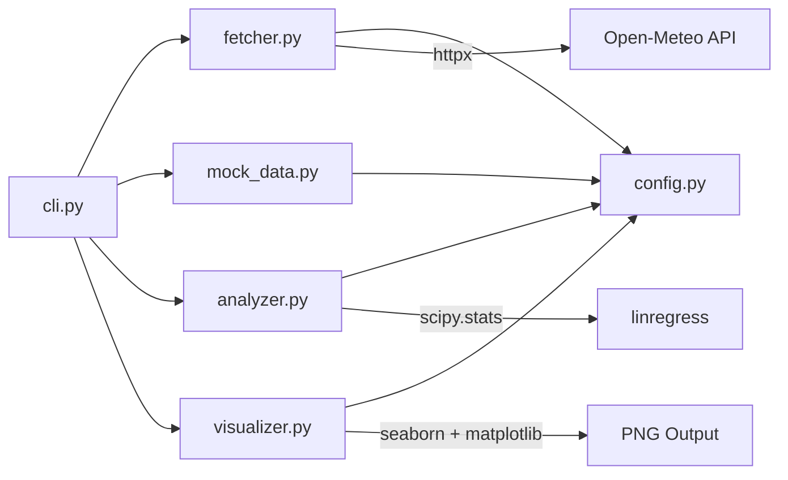

# Weather Trends Analyzer — Master Plan

## 1. Vision & Motivation

Analyze global temperature trends from 1940 to 2025 using publicly available historical weather data. The tool fetches daily mean temperatures from 12 representative cities worldwide via the Open-Meteo Archive API, computes per-location anomalies relative to each city's long-run baseline, aggregates into a global mean anomaly time series, and produces publication-quality statistical visualizations.

**Why:** Provide a reproducible, transparent, data-driven view of observed temperature trends without relying on preprocessed datasets or third-party analyses. All data flows from raw API → computation → visualization with full traceability.

---

## 2. Architecture Overview

---

## 3. Phase Roadmap

---

## 4. Phase Details

### Phase 1: CLI Script (Current)

**Goal:** Transform the working prototype (`weather_trend.py`) into a properly structured, tested, Dockerized Python project.

**Deliverables:**
- `src/` module structure: `config.py`, `fetcher.py`, `mock_data.py`, `analyzer.py`, `visualizer.py`, `cli.py`
- Pydantic v2 data models for Location, DailyTemperatureRecord, YearlyAnomaly, TrendResult
- Full type annotations, ruff-clean
- pytest test suite at 100% coverage
- Dockerfile + docker-compose.yml
- `.gitlab-ci.yml` with lint → test → coverage → build → docker-build
- Launcher scripts (`run_weather_trends.sh`, `run_weather_trends.bat`)

**Gate criteria:**
1. `ruff check .` passes with zero errors.
2. `pytest --cov` reports 100% coverage.
3. `docker compose up --build` runs the analysis and produces charts in `output/`.
4. At least one test validates trend slope against a known synthetic dataset.
5. All charts save to `output/` as 300 DPI PNGs.

### Phase 2: Streamlit Dashboard

**Goal:** Interactive web interface for exploring temperature trends.

**Deliverables:**
- Streamlit app with sidebar controls (date range, city selection, chart type)
- Interactive charts via seaborn/matplotlib (rendered as images in Streamlit)
- Cached data fetching (Streamlit `@st.cache_data`)
- Dockerized with healthcheck
- City comparison view (select 2+ cities, overlay trends)

**Gate criteria:**
1. Dashboard loads within 5 seconds with cached data.
2. All Phase 1 chart types available interactively.
3. City filtering works correctly.
4. Docker healthcheck passes.

### Phase 3: FastAPI Backend + Scheduled Collection

**Goal:** Automated data pipeline with persistent storage and REST API.

**Deliverables:**
- FastAPI backend with endpoints: `GET /api/trends`, `GET /api/cities`, `GET /api/anomalies`
- PostgreSQL 16 for storing fetched data (no re-fetching for historical ranges)
- SQLAlchemy 2.0 async ORM + Pydantic v2 response models
- Scheduled collection via APScheduler or cron (daily update of recent data)
- Redis caching for frequently-requested aggregations

**Gate criteria:**
1. API endpoints return correct data matching CLI output.
2. Data persists across container restarts.
3. Scheduled collection runs without manual intervention.
4. Full CI/CD pipeline green.

---

## 5. Module Dependency Diagram

---

## 6. Data Flow

1. **Fetch:** `WeatherDataFetcher` queries Open-Meteo API for each location in `config.LOCATIONS`. Returns a combined pandas DataFrame with columns: `time`, `temperature_2m_mean`, `location`, `lat`, `lon`.
2. **Fallback:** If API rate-limited, `MockDataGenerator` produces synthetic data with configurable trend, seasonality, and noise parameters.
3. **Analyze:** `TrendAnalyzer` takes the combined DataFrame and:
   - Groups by `(year, location)`, computes per-location yearly means.
   - Computes per-location baselines (long-run mean).
   - Converts to anomalies (yearly mean - baseline).
   - Aggregates anomalies across locations: global mean, std, SE, 95% CI per year.
   - Runs `scipy.stats.linregress` on the yearly anomaly series → slope, intercept, p-value, R^2.
4. **Visualize:** `TrendVisualizer` takes anomaly series + trend result and produces:
   - Trend line chart with CI error bars and regression overlay.
   - Anomaly distribution histogram.
   - Per-city trend comparison.
   - Decade-averaged bar chart.

---

## 7. Technology Choices

| Component | Choice | Why |
|-----------|--------|-----|
| HTTP client | httpx | Async-capable, modern API, replaces requests per stack rules |
| DataFrame | pandas | Preferred over polars; ecosystem maturity, API familiarity |
| Statistics | scipy.stats.linregress | Accurate p-value, R^2; no fallback needed |
| Visualization | seaborn + matplotlib | Preferred over plotly; publication-quality static charts |
| Data models | Pydantic v2 | Type-safe config and data contracts |
| Testing | pytest + pytest-cov | Standard; 100% coverage target |
| Lint/format | ruff | Single tool for lint + format |
| Packaging | uv + pyproject.toml | Modern Python packaging |
| Container | python:3.13-slim | glibc-based; scipy/numpy wheel compatibility |
| CI/CD | GitLab CI | Standard per global rules |

---

## 8. Locations (12 Representative Cities)

Selected for geographic diversity (both hemispheres, multiple continents, coastal and inland, tropical and polar-adjacent):

| City | Latitude | Longitude | Region |
|------|----------|-----------|--------|
| New York | 40.7128 | -74.0060 | North America, East Coast |
| London | 51.5074 | -0.1278 | Europe, Maritime |
| Tokyo | 35.6762 | 139.6503 | East Asia, Coastal |
| Sydney | -33.8688 | 151.2093 | Southern Hemisphere, Oceania |
| Cairo | 30.0444 | 31.2357 | North Africa, Arid |
| Rio de Janeiro | -22.9068 | -43.1729 | South America, Tropical |
| Mumbai | 19.0760 | 72.8777 | South Asia, Monsoon |
| Moscow | 55.7558 | 37.6173 | Northern Eurasia, Continental |
| Beijing | 39.9042 | 116.4074 | East Asia, Continental |
| Cape Town | -33.9249 | 18.4241 | Southern Africa, Mediterranean |
| Los Angeles | 34.0522 | -118.2437 | North America, West Coast |
| Singapore | 1.3521 | 103.8198 | Equatorial, Maritime |

---

## 9. Cross-Phase Concerns

- **Location list** is config-driven. Phase 2 adds UI for selecting/deselecting cities. Phase 3 stores city metadata in the database. The Pydantic `Location` model is the contract across all phases.
- **Data format** (DataFrame columns: `time`, `temperature_2m_mean`, `location`, `lat`, `lon`) is the shared contract. Phase 3 maps these columns to PostgreSQL table columns.
- **Anomaly calculation** logic lives in `TrendAnalyzer` and must produce identical results whether data comes from API, mock generator, or database.
- **Chart generation** code is reusable across CLI (save to file), Streamlit (render in browser), and API (return as bytes).